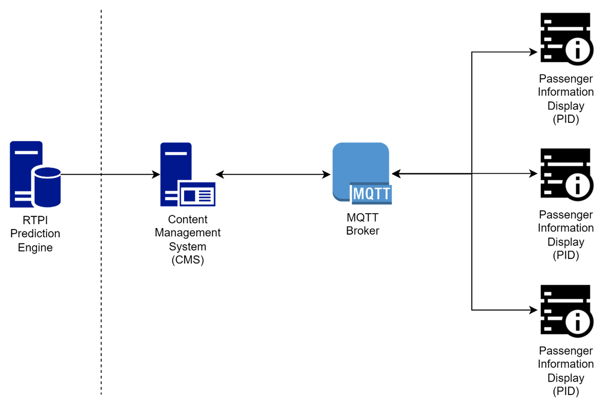
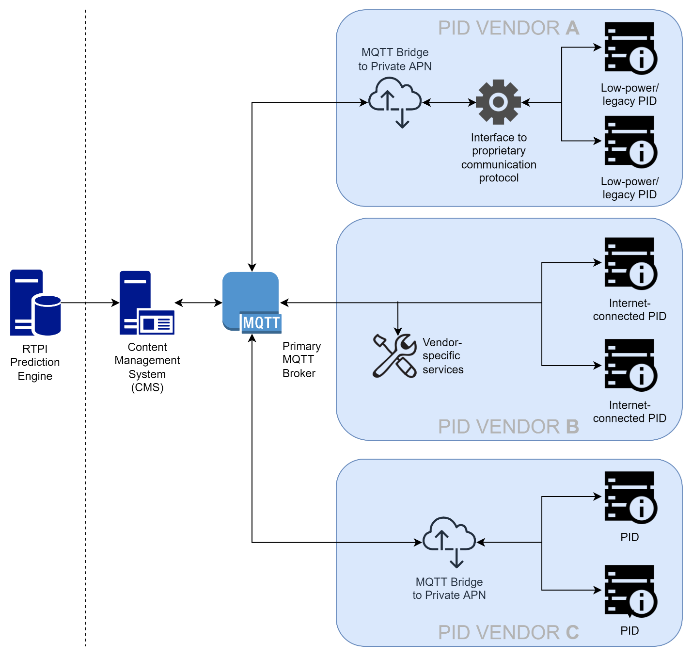
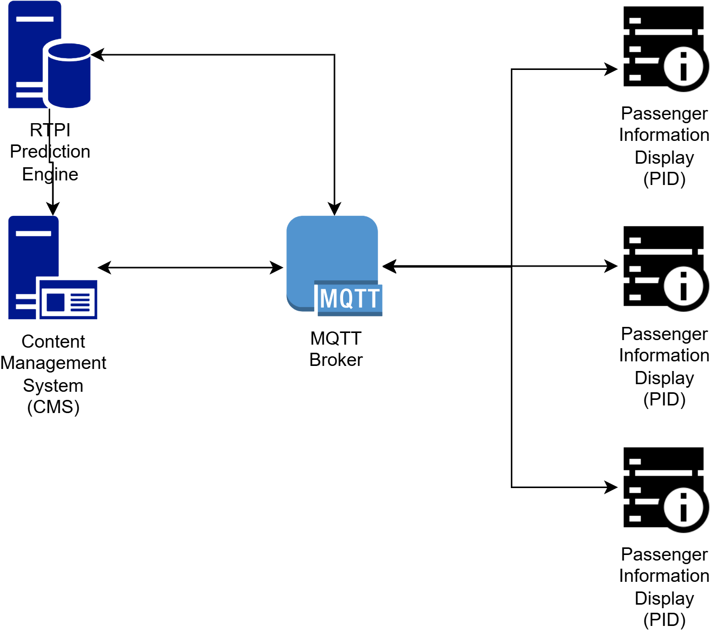
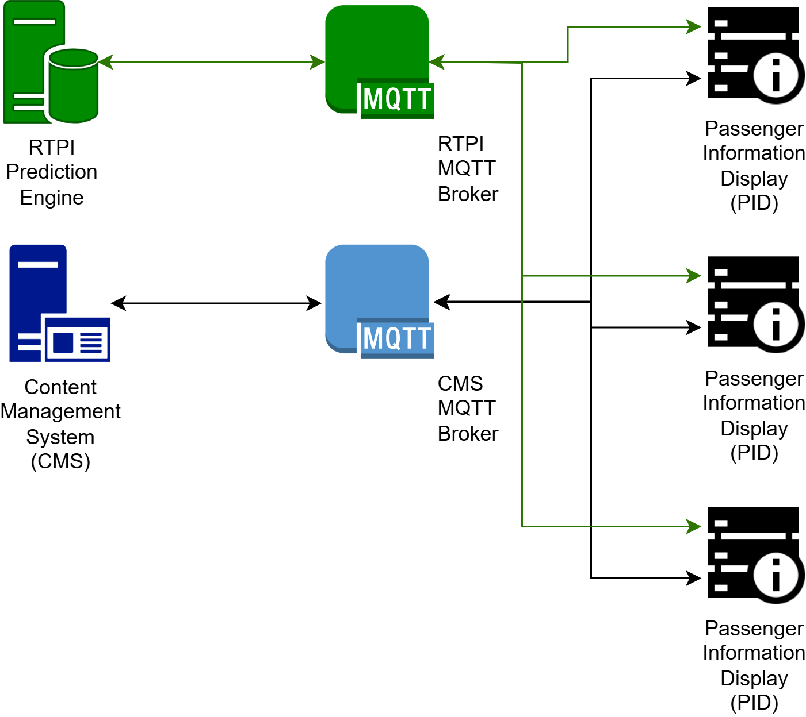

# CMS to PID Interface Protocol

# Part 1 - Architecture


## Status of this document

If there are any comments or feedback arising from the review or use of this document, please contact us at secretariat@rtig.org.uk


# Communications Infrastructure

* Due to the real-time nature of the communication required between the CMS and PIDs, this document proposes the use of an Internet-of-Things (IoT) approach, using the standard MQTT[[1]](https://mqtt.org/) communication protocol to provide a publisher-subscriber messaging technology.

* This choice has been made as it enables interoperability of devices and services (as both data providers and data consumers) from multiple vendors within a well-documented and well-understood standard framework.

* The interface protocol will prescribe the interactions that should occur between connected devices and services, together with the data structures that should be used to exchange standardised information while fully supporting extensibility of a system through the addition of new classes of device, new classes of message or extensions of standard messages.

## Pub-Sub Model

* A publisher-subscriber or pub-sub model is a very simple and widely used concept. Any device (with the appropriate authorisation) can act as a data supplier, a data consumer - or both, as is the case for the CMS and PIDs in this interface protocol.

* Whenever data is published (or republished) by a data producer, it is issued (or reissued) automatically to all subscribers in near real-time. This means that there is no requirement for repeated polling (and potential overloading) of central services by devices that need to "refresh" their data at frequent intervals.

* Using this model, a publisher does not require any direct knowledge of its subscribers - i.e. how many there are or which message type(s) they are subscribing to; likewise, a subscriber does not need any direct knowledge of the data publisher - i.e. which publishers are publishing which message type(s).

* Publishers communicate with subscribers asynchronously by broadcasting events to the network, rather than by synchronous remote procedure calls (RPCs). Each broadcast event is given a topic which is analogous to a radio broadcast "channel"  A message broker is used to manage the subscriptions and ensure that every subscriber receives the published messages that it is subscribed to.

## Message Broker

* The message broker is the heart of the pub-sub network. It maintains the subscription information and ensures that the correct messages are "forwarded" to the correct subscribers.

* The message broker also provides authentication, message integrity and high-level security management.

* Many open source MQTT brokers are available, and it is intended that these should be used to support the CMS-to-PID interface, thereby avoiding licensing costs and avoiding software vendor lock-in.

* The MQTT broker must support and use v5.0 for the CMS-to-PID interface.

## Architectural Overview

* In the simplest form, the interface between the CMS and PIDs can be visualised as the addition of a single "off-the-shelf" MQTT broker between the CMS and the PIDs:



Figure 1 High-level overview of architecture

* Under this architecture, the CMS and each PID will each act as a bidirectional MQTT client (i.e. a publisher of and subscriber to MQTT messages). There are MQTT client libraries for the majority of commonly-used programming languages and operating platforms; it is therefore anticipated that no low-level programming will be required of any suppliers using this interface protocol.

N.B. The RTPI prediction engine and its means of communication with the CMS are outside the scope of this interface. It is shown purely to signify that all predictions are managed by the CMS, which will then publish RTPI predictions to the MQTT network.

## Security

* The majority of MQTT message brokers (including open-source products) support some degree of security management. Whilst message encryption might be of lesser concern within a private network (e.g. private APN or VPN) it is a fundamental consideration for any network that uses the public internet.

* This interface protocol does not therefore require the use of any specific encryption mechanism; it recommends that this should be chosen and specified as a project requirement by the contracting body dependent on a number of factors such as:

* The network types in use
	* i.e. if the public internet is not being used, is sufficient protection already given by an APN or VPN?

* The processing capability of PID on-board computers
	* i.e. do they have sufficient processing power to support full TLS-compliant encryption?

* Analysis of the perceived security risks
	* e.g. would pre-shared key (PSK) encryption be sufficient for the proposed network, given that no GDPR-related data is being transmitted across the network?

* The minimum level of security shall be the use of basic Username and Password Authentication. It is recommended, but not mandated, that each PID uses a different username and password. The username and password must be provided securely to the display.

## Network Bridging

* It is clear that where messages need to be transferred between networks, some kind of bridging mechanism will be required. Many MQTT message brokers (including open-source implementations) support fully configurable bidirectional network bridging as standard. These should be used to support communication between the public internet and private APNs or VPNs.

N.B. When using network bridging message brokers, they will need to be configured with the appropriate pre-shared keys and/or TLD capability to handle internet-side encryption.

## Multi-Vendor Architecture

* In practice, particularly in a multi-vendor environment, it is likely that PIDs will reside on separate networks (often using private APNs) and an implementation of this interface protocol will therefore require message bridging between the networks. In the case, it will be the responsibility of each supplier to provide a suitable MQTT bridge to its PID network. A number of open-source MQTT brokers offer bridging capabilities with an appropriate configuration.

* In an implementation where there are pre-existing legacy PIDs, it is likely that it will not be possible to retro fit MQTT compatibility directly into the PIDs (either via a firmware update or a hardware update). In this case, it will be the responsibility of the of the legacy supplier to provide a bidirectional interface between MQTT and their proprietary communication protocol.

* In addition, where PIDs require vendor-specific services that are provided by a supplier, they can be directly integrated into the MQTT network, for example:



Figure 2 Multi-vendor architecture example.

* In the example above, each vendor supplies different PID types but they are all connected to a common CMS via the primary MQTT broker:

* Vendor A supplies low-power (or legacy) PIDs; these do not have the power/capability to connect directly to the public internet (or meet the project-specific encryption requirements). An MQTT bridge is therefore used to provide bi-directional communication between the primary MQTT broker and Vendor A's interface - which may also act as a secondary CMS for the connected PIDs.

* Vendor B supplies internet-connected PIDs that have the necessary capabilities to meet the project-specific encryption requirements. In this example, vendor B also supplies their own fault management reporting system that is connected to the network via MQTT.

* Vendor C PID's are connected using a private APN and must therefore supply and configure an MQTT bridge to connect their APN with the public internet.

* It is possible under the architecture for one Vendor to provide CMS services and another Vendor to provide RTPI prediction engine which provides timetable and real time data either direct to the primary MQTT broker, via a multi broker MQTT arrangement or via a MQTT bridge between MQTT brokers for example:



Figure 3 Multi vendor RTPI / CMS sharing a single MQTT Broker example.



Figure 4 Multi vendor RTPI / CMS with their own MQTT Broker example

## MQTT Broker Availability

* The preceding architecture diagrams represent the MQTT broker as a single network node - and thus a potential "single point of failure" . Since MQTT is designed to be a high-availability high-resilience protocol, support for broker clustering (with failover) is supported by the majority of MQTT brokers, including open-source implementations. It is strongly recommended that these clustering features are used when implementing the CMS-to-PID protocol.

# Message Structure

## Messages

* Every message published to the network is assigned a topic - but not a destination address - since the publisher does not know who the subscribers are. A controlled list of protocol-specific message topics (and the structure of each topic id) is therefore crucial to the design of the CMS-to-PID interface.

* The data payload of a published message will be dependent on the topic. Examples of topics might be "timetabled departure" , "real-time departure" , "emergency message" . Full details of the topics for this interface can be found later in this document.

* Where binary content (e.g. images, video, audio) needs to be exchanged between devices, it is strongly recommended that this is achieved without attempting to encode the binary content into MQTT message payloads. A multimedia referencing mechanism is provided by the interface to support the transfer of external binary content independently across the network, i.e. using HTTP(S).

* There is nothing to stop a PID or CMS vendor from creating their own additional topics - for example to exchange PID-specific configuration or low-level fault reporting - the only requirements of the CMS-to-PID interface is that vendor-specific topics do not collide with the naming hierarchy set out in this document, and that they adhere to the naming conventions wherever possible.

* MQTT v5 supports the concept of message retention and expiry. This means that a broker will retain messages until they expire; this can be valuable if a client device restarts (or disconnects from and reconnects to the MQTT network for any other reason). However, message expiry time must be chosen carefully: too short and they could be lost before a client has a chance to consume them; too long and the volume of unexpired messages could overwhelm the broker's finite resources. An expiry interval of 3600 seconds is suggested as a reasonable starting point for a CMS-to-PID protocol implementation.

## Device Discovery

* It is desirable for new devices to added into the network dynamically using a "discovery" mechanism; since there is no concrete concept of message "addressing" in a pub-sub network, this process becomes easier to implement. When a new PID is connected for the first time (or after it undergoes a reset) it shall announce its presence by publishing to a discovery topic; by default the CMS and any vendor-specific management services on the network will subscribe to the discovery topic and will in turn publish configuration data specific to that PID.

## Device Initialisation

* Once a device is configured, or following a reboot, the device will need to request its initial data. To minimise data volume, it is likely that the data broker will only hold recent real time data for a given bus stop, to overcome what would otherwise be an incomplete set of data the device should upon boot or initialisation request a complete set of data.

## Heartbeat and Status Messaging

* In order to give feedback about the status and the health of devices connected to the network, each device should publish a "heartbeat" message at regular intervals, so that the other devices are aware that it is still "alive" . The receipt (or non-receipt) of heartbeat messages can also be used by each device to make judgements about the state of the communications network. Since there will be many devices on a network, and heartbeat messages will need to be published (relatively) frequently to maximise their benefit, the content of these messages is kept to an absolute bare minimum. A heartbeat interval of 30 seconds is suggested as a reasonable starting point for a CMS-to-PID protocol implementation.

* General status messaging - which by definition will include considerably more detail resulting in larger message payloads - as a result are decoupled from the heartbeat messages.

## Vendor-Specific and Future Services

* The design of the network supports the addition of new devices and services over time. Such devices need not be limited to new types of hardware - for example, it may be useful to add a purely software-based logging and/or data analysis service that can record certain messages over a period of time and provide statistical analyses and meaningful insights into the performance of the RTPI system - for example, a service could be developed to monitor departure cleardown latency by calculating the difference in message publishing timestamps between cleardown requests and acknowledgements.

* As the business requirements for future services are defined and it is identified that there is a general industry interest in this requirement these can be added to the protocol using an additional part to the interface documentation.

# Message Topics

## MQTT Messaging

* A detailed description of the packet structure used for MQTT messaging is beyond the scope of this document. Numerous MQTT software libraries are available, and it is therefore not intended that suppliers implementing this interface will need to write their own low-level code to manage the MQTT messaging protocol.

* For the purpose of this interface protocol, it is sufficient to understand that in addition to the required messaging headers, each MQTT message contains a data "payload" . The MQTT standard does not dictate how this should be formatted, structured or encrypted - but in practice JSON (JavaScript Object Notation) is most commonly used; it is therefore assumed that the CMS-to-PID interface protocol adheres to this convention and all examples given will be structured as JSON objects.

## Topic Naming

* Topics are arranged into a hierarchy, which is analogous to a folder structure within a file system. Under this analogy, a topic name can be represented by the fully qualified path to a file.

* The following rules apply to publishing and subscribing to topic names:

	* The "/" character is used to separate the constituent parts of the topic name into the hierarchical elements. There should not be a leading "/" at the beginning of the topic name.

	* A leading "/" character should not be used at the start of the topic name.

	* Spaces in topic names are permitted by MQTT but are not permitted under this interface protocol.

	* The "+" character is used as a wildcard that matches a single level in the hierarchy. It should only therefore appear between two "/" characters.

	* The "#" character is used a wildcard that matches multiple levels in the hierarchy. It can only be used as the final character and must be preceded by a "/" character.

N.B. Wildcards can only be used by MQTT subscribers; publishers must always create messages to fully specified topics.

## Topic Hierarchy

* The following hierarchy is adopted for the CMS-to-PID interface:

* The top level in the hierarchy will be the device type of the message publisher - e.g. "CMS" , "PID-LED" , "DS" (see device type enumeration later in the document). Note that a conscious decision has been made not to include a vendor id within the topic hierarchy.

* At the simplest level, a CMS could be configured to listen for all messages originating from LED-based and LCD-based PIDs using the wildcarded topic names:

```json
PID-LED/#
PID-LCD/#
```

* The next two levels in the hierarchy are reserved for the message type and message phase. (Message type names and phases names are defined later in the document.)

* The remaining level(s) in the hierarchy define the intended destination (or destinations) of the message. For example, for messages originating from a CMS and intended for PIDs, the topic hierarchy will contain one or more elements of a fully qualified address of the form:

```json
{locality_id}/{cluster_id}/{stop_id}/{vendor_id}/{device_id}
```

* Within the UK, {locality_id} could correspond with an NPTG locality, {cluster_id} could correspond with a NaPTAN stop area id and {stop_id} could correspond with a NaPTAN stop point ATCO Code.
* Note that it is not necessary to target an individual device directly; shortened versions of the hierarchy above could be used to target all PIDs at a stop, in a cluster or in an entire locality:

```json
{locality_id}/{cluster_id}/{stop_id}
{locality_id}/{cluster_id}
{locality_id}
```

* A CMS broadcasting an information message to all PIDs within a certain locality could then send a message to topic

```json
CMS/InformationMessage/content/townCentre
```

* Any PID that had been configured with a subscription to this topic would then receive the message.
* To send a more targeted message, the CMS could include a cluster id, a stop id and even a device unique id:
```json
CMS/informationMessage/content/townCentre/999G123
CMS/informationMessage/content/townCentre/999G123/9990123A
CMS/informationMessage/content/townCentre/999G123/9990123A/ABCD1234567890
```
* To receive any of these messages, each PID would be configured to subscribe to multiple topics. In order to minimise the number of subscriptions required, it would be possible for a PID to subscribe to all message types (originating from a CMS) at once using the following wildcarded topic names:
```json
CMS/+/+/townCentre
CMS/+/+/townCentre/999G123
CMS/+/+/townCentre/999G123/9990123A
CMS/+/+/townCentre/999G123/9990123A/ABCD1234567890
```
* If we were to assume that each level of the qualified address was fully contained within the previous level (e.g. any given cluster was completely contained within its parent locality) we could extend the use of wildcards:
```json
CMS/+/+/townCentre
CMS/+/+/+/999G123
CMS/+/+/+/+/9990123A
CMS/+/+/+/+/+/ABCD1234567890
```
* In situations where {locality_id} and or {cluster_id} are not known, for example if the display is standalone or not allocated to a cluster then the word "˜null"™ should be used.

## Topic Extensibility

* It is possible for CMS and/or PID vendors to use the MQTT messaging platform for additional custom message types. To avoid clashes with the official topic names, the interface protocol requires that all vendor-specific topic names are prefixed with two levels of hierarchy - "VSS" (i.e. vendor-specific service) followed by a unique vendor id (to be agreed between parties as part of each project implementation).
 
N.B. The concept of a unique vendor id is also required in some of the interface message types defined below. It is therefore a requirement that all vendors within a project are allocated such an id regardless of whether they plan to create their own vendor-specific topics.

## Device Mimicking and Duplication

* By subscribing to exactly the same message topics as another device, it is possible to duplicate or mimic an existing display - for example in a test or simulation environment.

* In a production environment, where multiple identical displays are required (for example both sides of a totem) it is recommended that messages are targeted at a {stop_id} level, so that each display will still have its own unique id within the system.

# Appendix 1 Glossary


| APN | Access Point Name. A public APN is typically shared by all consumers of a mobile network. Conversely, a private APN is provided by a mobile network operator specifically for a single customer; only SIM cards provided by the operator to that customer can access the private APN. |
| ATCO | Association of Transport Coordinating Officers |
| BODS | Department for Transport's Bus Open Data Service |
| CMS | Content Management System. |
| CRS | Computer Reservation System, a 3 letter code allocated to most major junctions and railway stations in England Scotland and Wales |
| CSS | Cascading Style Sheets . CSS is a computer language for laying out and structuring web pages (HTML or XML) |
| GTFS | General Transit Feed Specification, a standardized data format that provides a structure for public transit agencies to describe the details of their services such as schedules, stops, fares, etc. |
| HTML | HyperText Markup Language |
| IANA | The [Internet Assigned Numbers Authority](https://www.iana.org/) and is an organization responsible for coordinating key elements of the internet's unique identifiers, like IP addresses and domain names. |
| JSON | JavaScript Object Notation is a standard data interchange format that's lightweight, human-readable, and compatible with many programming languages. |
| MIME | MIME (Multipurpose Internet Mail Extensions) is an internet standard that extends basic internet protocols to support sending and receiving email messages containing various media types, including text, images, audio, and video, beyond basic ASCII text |
| MQTT | the Message Queuing Telemetry Transport protocol is an open OASIS and ISO standard (ISO/IEC 20922) that enables the exchange of arbitrary data between two machines without a direct communication link between them. The protocol defines no encoding scheme for the payload data. MQTT is very popular in the Internet of Things (IoT) space. MQTT can work over TCP, UDP and WebSockets. |
| NeTEx | Network Timetable Exchange is a CEN/ Technical Standard for exchanging Public Transport schedules, fares and related data |
| NTP | Network Time Protocol is used to synchronize computer clock times in a network. It belongs to and is one of the oldest parts of the TCP/IP protocol suite. |
| PID | Passenger Information Display. |
| PMR | Professional mobile radio. Also known as private mobile radio in the UK and land mobile radio (LMR) in North America. |
| Prediction Engine | the source of predicted arrival times at bus stops for each journey, derived from a combination of current vehicle locations with statistical analysis of previous arrival times and potentially other factors such as weather, congestion, event management, etc. |
| RTPI | Real-Time Passenger Information. |
| SIRI | Standard Interface for Real-time Information is a CEN/ Technical Standard for exchanging real-time information about public transport services and vehicles |
| TfW | Transport for Wales |
| TIPLOC | Timing Point Location, essentially a shortened version of the rail location's full name. |
| TLS | Transport Layer Security is the successor of the deprecated Secure Sockets Layer (SSL). It is a [cryptographic protocol](https://en.wikipedia.org/wiki/Cryptographic_protocols) designed to provide communications security over a computer network. It is most commonly known for providing the "secure" component (i.e. the "S" ) in HTTPS. |
| TLS | Transport Layer Security |
| UUID | A UUID (Universally Unique Identifier) is a 128-bit number used to uniquely identify information in computer systems |
| VPN | Virtual private networks extend [private network](https://en.wikipedia.org/wiki/Private_network)s across public networks (such as the internet). |


