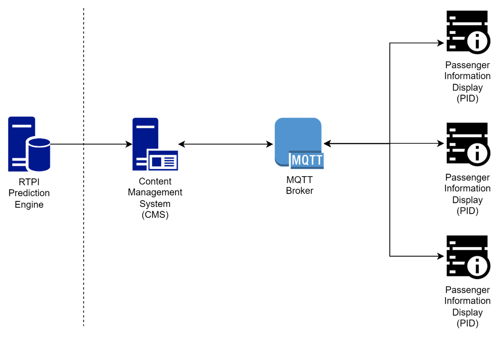
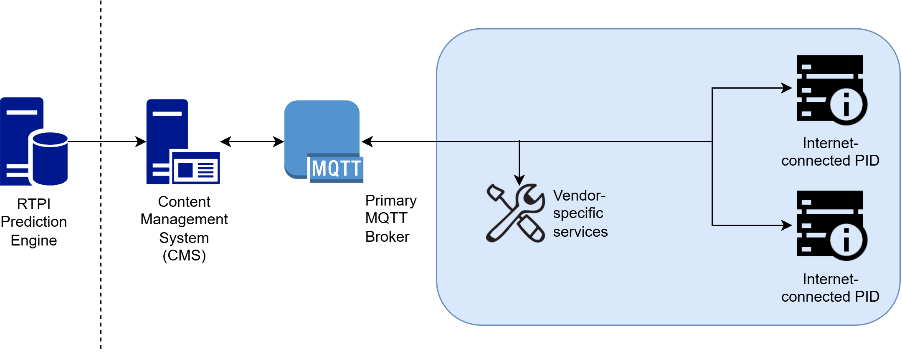
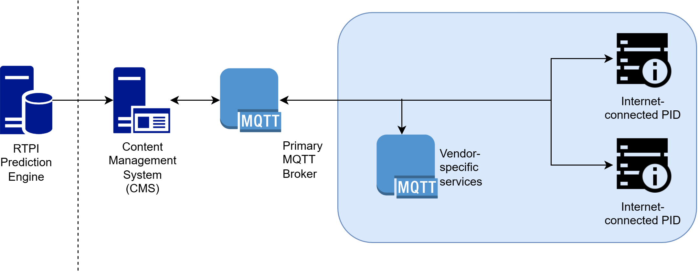
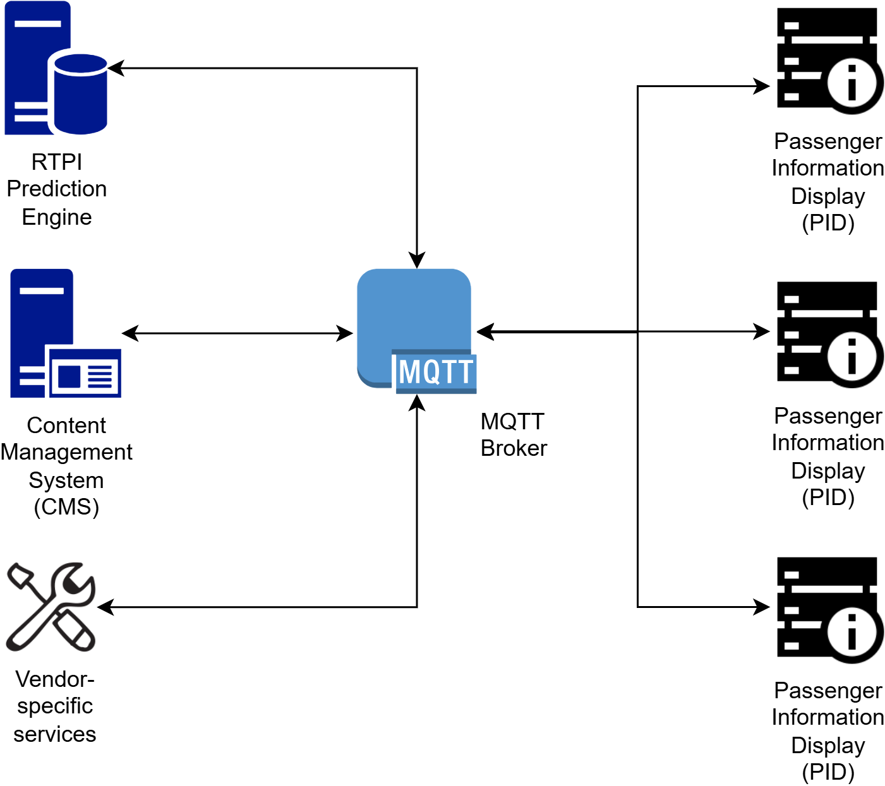

# CMS to PID Interface Protocol

## Part 4 - Additional Services


## Status of this document

This document is Draft.

If there are any comments or feedback arising from the review or use of this document, please contact us at secretariat@rtig.org.uk

# Architecture

## Overview

* In the simplest form, the interface between the CMS and PIDs can be visualised as the addition of a single "off-the-shelf" MQTT broker between the CMS and the PIDs, as described in Part 1 of the series:



* In a multi vendor environment, it is possible that the provider of the content management system is not the provider of the display, nor the maintenance provider for the display.

* In this situation the maintenance provider may need to be able to obtain additional information about the operating and equipment status of a display beyond that described in Part 2 of the standard. Providing access to the maintenance related information and other services are described in this Part of the standard.

* The architecture where this is being used may one where a single MQTT server is used by multiple suppliers, or it may be that a separate MQTT server is provided by the maintenance supplier or provider of the additional services.







## Scope

* This part of the protocol sets out to support the data necessary to provide maintenance services for displays.

* It aims to support the data necessary to manage the performance and availability of the display and associated Service Level Agreements (SLA), but not does not provide the calculation of an SLA which is the responsibility of separate services.

* Neither does the protocol set out to enable the direct raising of tickets or fault reports, though the data described could be used to do this.

* This version of Part 4 provides for static (or infrequently changing) and dynamic data in the same topic structure for ease of migration from existing supplier bespoke solutions to this open standard. At a point in future it is envisaged that static and dynamic data will be separated into different topic structures, potentially to align with work planned by ITxPT.

# Additional Services

## Status Response

* Within Part 2 there is a Basic Status Report which provides basic information about a display's operational status. This is sufficient to provide a minimum level of information for a user of a content management system to identify the operational status of a display. This is not however sufficient for an organisation responsible for managing the maintenance of a display.

* Two use cases - request from CMS/maintenance system to display whjich responds with full response with all elements that the display is capable of providing.

* An enhanced Status Response is therefore provided here. All are optional elements, where used it is important to ensure that naming and keys remain consistent.
```json
{
	"statusResponse": {
		"vendorId": "VENDOR001",
		"deviceId": "ftyf-2k73-tm",
		"requestId": "a2047a18-75aa-4bd1-a281-5fbae13d6cf1",
		"statusReport": {
			"firmwareVersion": "4.8.6.0", // firmware image package version
			"operatingSystem": "Linux 6.1.0-rpi6-rpi-v8", // uname -rs
			"devicemonitoringVersion": "0.0.1.2", // application version
			"memoryUsage": "45%", // estimate of physical memory usage in %
			"loadAverage": "13%", // estimate of 5 minute load average in %
			"diskFreeSpace": "9.5 GB", // free space on the device
			"audioLevel": "50%", // audio output level currently set for display
			"batteryCapacity": "85%", // for battery displays - estimate of battery capacity in %
			"batteryVoltage": "12.2", // for battery displays, battery voltage
			"lastSchedule": "2023-11-14T12:52:16+00:00", // time Schedule information was last processed by the display
			"lastRti": "2023-11-14T12:52:16+00:00", // time RTI information was last processed by the display
			"ipAddress": "192.168.80.1", // local ip address of the network connection
			"macAddress": "2c:f0:5d:2b:fb:9b", // mac address of the default network interface
			"upSince": "2023-11-14T12:44:24+00:00", // time since last display start
			"connectedSince": "2023-11-14T12:52:16+00:00", // last time modem connected to network
			"signalQuality": 60, // estimate of signal quality % if network access is mobile, for 2G use rssi to estimate.
			"signalPower": 80, // estimate of signal strength % if network access is mobile, omit this for 2G
			"rssiMeasurement": -83, // measured in negative dBm used for 2G mobile networks.
			"networkType": "MOBILE", // MOBILE, WIFI, ETHERNET, NONE
			"networkTypeDetail": "LTE", // 3G, EDGE, LTE, 5G if network access is mobile
			"networkProvider": "EE", // name of network provider if network access is mobile
			"modemType": "R1510L-4L-A02EU", // if display has separate modem module
			"modemUpSince": "2023-11-13T08:18:22+00:00", // if display has separate modem module
			"modemModel": "EC25-EC", // if display has separate modem module
			"modemFirmwareVersion": "EC25ECGAR06A09M1G_01.001.01.001", // if display has separate modem module
			"modemSoftwareVersion": "5.1.0 (4fa16757)", // if display has separate modem module
			"modemHardwareVersion": "1.0.1", // if display has separate modem module
			"modemSerialNumber": "05970123060033", // if display has separate modem module
			"modemIpAddress": "10.2.5.12", // if display has separate modem module
			"imei": "1234567890", // mobile modem IMEI number if network access is mobile
			"iccid": "8944303352457583385F", // SIM card iccid number if network access is mobile
			"imei2": "1234567890", // second mobile modem IMEI number if network access is mobile
			"iccid2": "8944303352457583385F", // second SIM card iccid number if network access is mobile
			"activeIccid": 2 // if second SIM is active
			"displayOverride": "OFF" // if a display override is active, set to enum,
			"lightLevelLumens": 400 // integer,
			"ambientNoiseDb": 50 // integer, measured in dB,
			"ambientNoise": 75 // integer, measured in % of maximum measurement
			"displayCaseOpen": True // "true / false" status of the display case.
		}
	}
}
```
## Sensor Events

* Sensor events are driven by the display and pushed to the MQTT broker periodically or upon change. The trigger for a sensor event could be set by the display configuration, for example triggering a sensor event when a battery falls to less than 25% of capacity, or when inside temperature of the display is over 40ºC.

* Sensors should respond to a status response, as part of the generic statusResponse status and to a specific request to the specific sensor.

## Display Terminal Operations

* This topic is optional and is mainly for development purposes, it might be disabled in production.

* Display will subscribe to the MQTT topic
```json
{device_type}/deviceTerminal/request/{vendor_id}/{device_id}
```
* The CMS will send a request of the form
```json
{
	"deviceTerminalRequest": {
		"requestId": "ad3ccebe-0611-4d4c-8ab3-7e1e6882b08b",
		"senderId": "fc867e8a-4e9c-465d-847d-6bf2fb37977f",
		"commandSequence": 534,
		"command": "uname -a",
		"timestamp": "2022-01-12T10:32:14-00:00"
	}
}
```
* senderId - string - optional is a unique identifier of a command request, to identify which entity on the CMS requested this command execution. For example if multiple users are executing commands on the same device, the CMS can display command responses to the specific user which requested command execution.

* commandSequence - Integer - optional Command sequence identifies specific command, which can be then used in command responses to group multiple responses for the same command. For example if a user executes a command which takes time to complete, device can return multiple responses with progress status for this command.

* command - String - Actual command to execute on the device. Can be operating system shell or device software command

* timestamp - String - ISO8601 formatted date and time to indicate when the command was requested.

* When the shell command is completed, display should respond by posting the response to
```json
{device_type}/deviceTerminal/response
```
* The response takes the form:
```json
{
	"deviceTerminalResponse": {
		"vendorId": "VENDOR0001",
		"deviceId": "ABCD1234567890",
		"requestId": "ad3ccebe-0611-4d4c-8ab3-7e1e6882b08b",
		"senderId": "fc867e8a-4e9c-465d-847d-6bf2fb37977f",
		"commandSequence": 534,
		"commandResponse": "Linux raspberrypi8 6.1.21-v8+ #1642 SMP PREEMPT Mon Apr 3 17:24:16 BST 2023 aarch64 GNU/Linux"
		"timestamp": "2022-01-12T10:32:19-00:00"
	}
}
```
* senderId - String - optional Copy of senderId received in terminal request.

* commandSequence - Integer - optional Copy of commandSequence received in terminal request.

* commandResponse - String - Result of the command execution.

* timestamp - String - ISO8601 formatted date and time to indicate when the command was responded.

## Display update operations

* With the multiple potential operating systems, manufacturer and display specific configuration the update of software and configuration is best left to vendor specific solutions rather than a standardising the approach.

## Display reset

* Display will subscribe to the vendor specific MQTT topic
```json
{device_type}/reset/request/{vendor_id}/{device_id}
```
* The CMS will send a request of the form
```json
{
	"resetRequest": {
		"vendorId": "VENDOR0001",
		"deviceId": "ABCD1234567890",
		"requestId": "fc867e8a-4e9c-465d-847d-6bf2fb37977f",
		"resetType": "DATA", // to match the enumeration list
		"timestamp": "2022-01-12T10:32:14-00:00"
	}
}
```
* ResetType shall be one of:
```json
[
	DATA,
	RESTART,
	FULL
]
```
* If resetType = DATA the display will clear any currently stored schedules, RTI prediction data and messages. This may be necessary if the display gets out of sync with the published data and needs a clean set of data publishing to it.

* If resetType = RESTART The display will simply reboot its OS and start again. No new discovery process should take place. The reset response message will contain the result "RESTARTING" and will be sent just prior to the reboot to confirm that the command was received. Once the display has rebooted it should send another resetResponse with the same requestId with the result set to DONE.

* It is expected that the display will immediately trigger a request for a fresh set of content. That is scheduledDeparture, realtimeDeparture and informationMessage to the display using Display request for content delivery

* If resetType = FULL The display will clear down all configuration and return to initial provisioning state, causing it to send a discoveryRequest message again. The reset response message will be sent prior to the discoveryRequest but does not need actioning other than logging.

* When a reset is completed, the display should respond by publishing a response to
```json
{device_type}/reset/response
```
* The response takes the form:
```json
{
	"resetResponse": {
		"vendorId": "VENDOR0001",
		"deviceId": "ABCD1234567890",
		"requestId": "fc867e8a-4e9c-465d-847d-6bf2fb37977f",
		"result": "DONE",
		"errorText": "text of error",
		"timestamp": "2022-01-12T10:32:19-00:00"
	}
}
```
* If there is an issue executing the reset then the result should be set to "ERROR" with optional errorText attribute to communicate cause of error.

## Fault reporting for data errors

* The schedule, RTI and messages data that is published for consumption by the display will normally be correctly formatted for processing by the display.

* Should the display have an issue with processing the incoming data i.e. invalid json or missing field then it should send a sensorEvent to the DATA sensor type.
```json
{device_type}/sensorEvent/service/DATA
```
* The response for this
```json
"sensorEvent": {
	"vendorId": "VENDOR0001", // unique within project
	"deviceId": "ABCD1234567890", // unique for the vendor
	"type": "DATA",
	"data": {
		"dataType": "scheduledDeparture",
		"errorText": "Malformed JSON",
		"errorRef": UUID // if available, eg. messageId
	}
}
```
* dataType shall be one of:
```json
[
	scheduledDeparture,
	realTimeDeparture,
	informationMessage,
	journeyMessage
]
```
* Should there be data errors, then this will generate alerts for the user within the CMS. The errorText should be sufficiently descriptive where possible for the user to understand what the issue is.

# Audio

## Speech Assets

* In order for audio systems to function, the sign will need to be aware of which speech assets to download, and the rules around what should be triggered for each of the triggers.

* The speech assets will by default comprise of English, and in the case of Welsh implementations Welsh & English with a Welsh accent audio file.

* To accommodate this, a request a will made to the following topic:
```json
{device_type}/getSpeechAssets/request/{vendor_id}/{deviceId}
```
* With a simple payload being an array of locationRef:
```json
["5710AWA11097"]
```
* The service will response on the topic:
```json
PID-TFT/getSpeechAssets/response/1234
```
* The response will contain two types of object:

### Speech Assets

* This will be a array of assets for the sign to download with the type and language specified, for example:
```json
{
	"url": "https://mediaassets.net/speech-assets/serviceAlias_6630_EN.mp3",
	"modified": "2024-02-19T15:16:39",
	"type": "locationRefAlias",
	"lang": "EN"
}
```
* The "type" can be one of the following enumerated status values:
```json
[
	locationRefAlias, // for the names of stops
	staticAsset, // for common words, letters, symbols and numbers
	phraseAsset // for predefined strings of spoken text.
]
```
### Speech Message

* This contains the data required by the sign to know which items to speak for each of the triggers, for each of the languages. Also, pre-configured commands can be used by the sign to read aloud the next *n* departures for instance.
```json
"speechMessage": {
	"modifiedAt": "2024-04-29T08:04:41.577Z",
	"variations": [
		{
			"speechMessageFileName": "97d8c52e-6ff2-4f9f-8e59-7d5d1dcdb34a",
			"lang": "CY",
			"type": "locationRefAlias",
			"text": "dyma Ffordd y Brenin" // phonetic version of text for TTS services
		},
		{
			"speechMessageFileName": "7b000590-0b01-472e-a640-73c13e9c8199",
			"lang": "EN",
			"type": "locationRefAlias",
			"text": "This is Kingsway"
		},
		{
			"speechMessageFileName": "890e9263-d4ef-4095-a688-a6d2c7b91cb8",
			"lang": "CY",
			"type": "phraseAsset",
			"text": "The services that depart from this stop are [service_to_destination_list]"
		},
		{
			"speechMessageFileName": "5f58d840-7b54-4062-bdf7-19d58adbe933",
			"lang": "EN",
			"type": "phraseAsset",
			"text": "The services that depart from this stop are [service_to_destination_list]"
		},
	]
}
```
### Trigger Configuration

* The "trigger" for audio anouncements through physical or software buttons or tiggers can be configured using one of the following enumerated status values:
```json
[
	TRIGGER1,
	TRIGGER2,
	TRIGGER3
]
```

